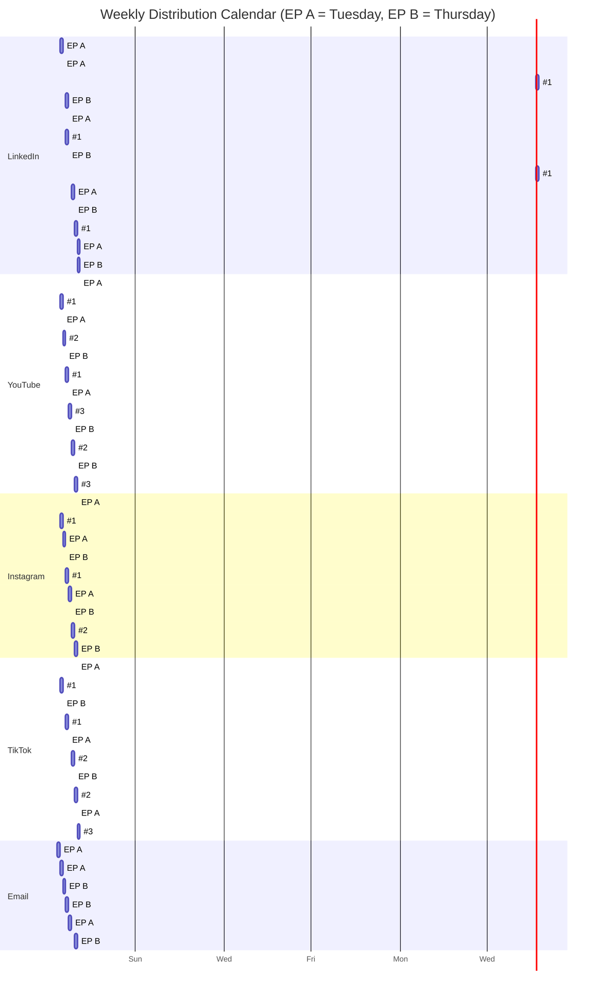
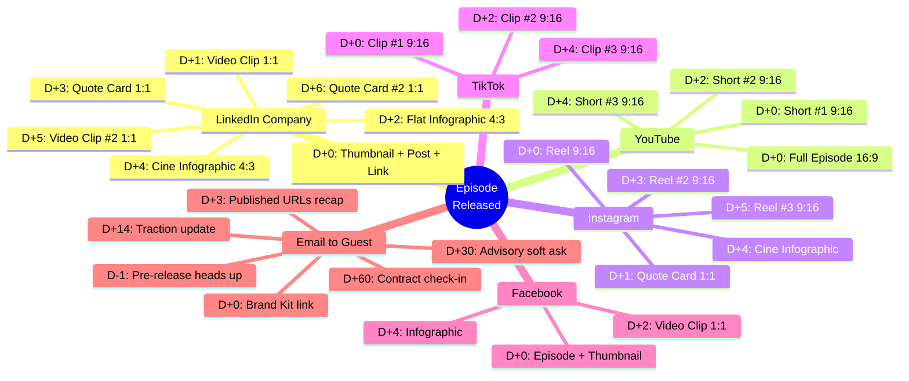
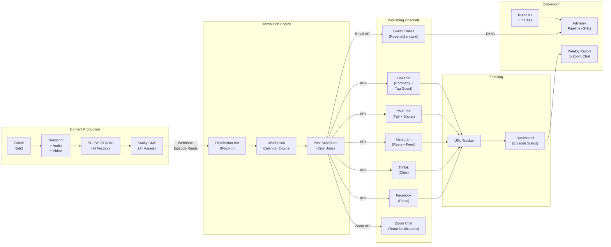

# YBH Full Pipeline: Episode Production → Distribution

```mermaid
flowchart TB
    %% ============================================
    %% STAGE 1: LEAD GENERATION & RECRUITMENT
    %% ============================================
    subgraph STAGE1["🎯 STAGE 1: LEAD GENERATION"]
        direction TB
        REPS["Sales Reps<br/>(5 brothers)"]
        NAV["LinkedIn Sales Navigator<br/>Filter: CTO/CIO/VP IT<br/>100-2000 employees"]
        DM["LinkedIn DM<br/>'Recruit IT leaders<br/>for the Podcast'"]
        VIDEO["Phil's 10-min<br/>Intro Video"]
        QUIZ["Fillout Quiz<br/>(3 IT Questions)"]
        BOOK["Book Pre-Podcast<br/>Call on Rep Calendar"]
        
        REPS --> NAV --> DM --> VIDEO --> QUIZ --> BOOK
    end

    %% ============================================
    %% STAGE 2: PRE-PODCAST & RECORDING
    %% ============================================
    subgraph STAGE2["🎙️ STAGE 2: PODCAST PRODUCTION"]
        direction TB
        PREPOD["Pre-Podcast Call<br/>(Rep runs deck)<br/>Discovery Questions<br/>+ Community Invite"]
        CASEFUEL["Casefuel Intake<br/>(Hidden Value Discovery)<br/>Internet, Firewall, MS,<br/>Telecom, Mobile, Cloud"]
        RECORD["Podcast Recording<br/>(Zoom, 45-60 min)<br/>Hosts: Phil, Michael,<br/>Mike, Douglas"]
        CIRCLE_EVENT["Circle Community<br/>Event Created"]
        
        PREPOD --> CASEFUEL
        PREPOD --> RECORD
        RECORD --> CIRCLE_EVENT
    end

    %% ============================================
    %% STAGE 3: POST-PRODUCTION
    %% ============================================
    subgraph STAGE3["✂️ STAGE 3: POST-PRODUCTION"]
        direction TB
        ZOOM_REC["Zoom Recording<br/>Available"]
        NOTIFY["Notification<br/>(Currently Manual)"]
        ADOBE["Adobe Podcast<br/>(Audio Editing)"]
        ZUBAIR["Zubair Edits<br/>(Nigeria)"]
        ZOOM_DOC["Zoom Workplace<br/>Production Doc<br/>(Upload Date +<br/>Release Date)"]
        
        DELIVERABLES["Zubair Delivers:<br/>✅ Edited Video<br/>✅ Final Audio<br/>✅ Transcript"]
        
        ZOOM_REC --> NOTIFY --> ADOBE --> ZUBAIR
        ZUBAIR --> ZOOM_DOC
        ZUBAIR --> DELIVERABLES
    end

    %% ============================================
    %% STAGE 4: PULSE STUDIO (AI FACTORY)
    %% ============================================
    subgraph STAGE4["🤖 STAGE 4: PULSE STUDIO"]
        direction TB
        UPLOAD["Upload Transcript<br/>to Pulse"]
        
        subgraph AI_GEN["AI Generation Pipeline"]
            direction TB
            PRF["1. PRF Generation<br/>(Podcast Reference<br/>Framework)<br/>Key insights extracted"]
            HOOKS["2. Viral Hooks<br/>(For YBH + Guest)"]
            META["3. Episode Metadata<br/>(→ Push to Sanity)"]
            LINKEDIN_POSTS["4. LinkedIn Posts<br/>(Release + Follow-up)<br/>→ Phil Reviews"]
            
            PRF --> HOOKS --> META --> LINKEDIN_POSTS
        end
        
        subgraph DESIGN["Design Studio (kie.ai)"]
            direction TB
            FLAT["2× Flat/Data<br/>Infographics<br/>(16:9 or 4:3)"]
            CINE["2× Cinematographic<br/>3D Infographics<br/>(16:9 or 4:3)"]
            QUOTE["3× Quote Cards<br/>(1:1)"]
            TIMELINE["1× Career Timeline<br/>(16:9, LinkedIn Scraper)<br/>🔒 Guest-only"]
            THUMB["1× YouTube<br/>Thumbnail"]
        end

        subgraph VIDEO_CLIPS["Video Production"]
            direction TB
            CLIPS["3× Video Clips<br/>(45s-1m10)<br/>Square (1:1) +<br/>Vertical (9:16)"]
        end
        
        UPLOAD --> AI_GEN
        UPLOAD --> DESIGN
        UPLOAD --> VIDEO_CLIPS
    end

    %% ============================================
    %% STAGE 5: BRAND KIT
    %% ============================================
    subgraph STAGE5["🎁 STAGE 5: BRAND KIT"]
        direction TB
        BRANDKIT["Brand Kit<br/>Landing Page"]
        BK_CONTENT["Contents:<br/>📄 PRF Document<br/>🎣 Viral Hooks<br/>🖼️ All Infographics<br/>🃏 Quote Cards<br/>📹 Video Clips<br/>📊 Career Timeline<br/>⬇️ Download Kit"]
        CTA["7 Sidebar CTAs<br/>(Rotating based on<br/>guest Sanity Check data)<br/>→ Scorecards<br/>→ 1:1 with Phil<br/>→ Community<br/>→ Case Studies"]
        
        BRANDKIT --> BK_CONTENT
        BRANDKIT --> CTA
    end

    %% ============================================
    %% STAGE 6: DISTRIBUTION BOT
    %% ============================================
    subgraph STAGE6["📡 STAGE 6: DISTRIBUTION"]
        direction TB
        
        subgraph PRE_RELEASE["Pre-Release (D-1)"]
            direction TB
            GUEST_NOTIFY["📧 Guest Email<br/>'Episode drops tomorrow!'"]
            REP_DASH["📋 Rep Dashboard<br/>Updated with<br/>release schedule"]
            ZOOM_BRIEF["💬 Zoom Chat<br/>'EP 392 releases<br/>tomorrow'"]
        end
        
        subgraph RELEASE_DAY["Release Day (D+0)"]
            direction TB
            LI_RELEASE["LinkedIn Company<br/>Thumbnail + Post<br/>+ Episode Link<br/>🏷️ Tag Guest"]
            YT_FULL["YouTube<br/>Full Episode"]
            YT_SHORT1["YouTube Short #1"]
            IG_REEL1["Instagram Reel<br/>Video Clip #1"]
            TT_CLIP1["TikTok<br/>Video Clip #1"]
            FB_POST["Facebook<br/>Episode + Thumbnail"]
            GUEST_EMAIL_LIVE["📧 Guest Email<br/>'You're live!<br/>+ Brand Kit link'"]
        end
        
        subgraph DRIP_WEEK1["Week 1 Drip (D+1 to D+6)"]
            direction TB
            D1["D+1: LinkedIn Video Clip #1<br/>YouTube Short #2<br/>IG Reel #2"]
            D2["D+2: LinkedIn Flat Infographic<br/>TikTok Clip #2<br/>IG Quote Card"]
            D3["D+3: LinkedIn Quote Card #1<br/>YouTube Short #3<br/>📧 Guest: 'What we published'"]
            D4["D+4: LinkedIn Cine Infographic<br/>TikTok Clip #3"]
            D5["D+5: LinkedIn Video Clip #2<br/>IG Reel #3<br/>FB Video"]
            D6["D+6: LinkedIn Quote Card #2<br/>IG Cine Infographic"]
        end
        
        subgraph DRIP_LATER["Follow-Up (D+7 to D+60)"]
            direction TB
            D14["D+14: 📧 Guest Email<br/>'Still getting traction!'<br/>+ Published URLs"]
            D30["D+30: 📧 Guest Email<br/>'Need help with vendors?'<br/>(Advisory soft ask)"]
            D60["D+60: 📧 Contract timing<br/>check-in (if renewal<br/>mentioned in Sanity Check)"]
        end
    end

    %% ============================================
    %% STAGE 7: TRACKING & CONVERSION
    %% ============================================
    subgraph STAGE7["📊 STAGE 7: TRACKING & CONVERSION"]
        direction TB
        URL_TRACK["URL Tracker<br/>All published URLs<br/>per episode/platform"]
        ENGAGEMENT["Engagement Monitoring<br/>Likes, comments,<br/>shares, clicks"]
        ADVISORY["Advisory Pipeline<br/>(GHL)<br/>Need Identified →<br/>1:1 with Phil →<br/>Vendor Engagement →<br/>Deal"]
        REFERRAL["Referral Ask<br/>'Know an IT leader<br/>for the show?'"]
        
        URL_TRACK --> ENGAGEMENT
        ENGAGEMENT --> ADVISORY
        D60 --> ADVISORY
        CTA --> ADVISORY
        D30 --> REFERRAL
    end

    %% ============================================
    %% CONNECTIONS BETWEEN STAGES
    %% ============================================
    STAGE1 --> STAGE2
    STAGE2 --> STAGE3
    DELIVERABLES --> UPLOAD
    STAGE4 --> BRANDKIT
    AI_GEN --> STAGE6
    DESIGN --> STAGE6
    VIDEO_CLIPS --> STAGE6
    BRANDKIT --> GUEST_EMAIL_LIVE
    STAGE6 --> STAGE7
    ADVISORY -->|"New guest<br/>referral"| STAGE1

    %% ============================================
    %% STYLING
    %% ============================================
    classDef stage1 fill:#1a1a2e,stroke:#F7B500,color:#fff
    classDef stage2 fill:#1a1a2e,stroke:#F17529,color:#fff
    classDef stage3 fill:#1a1a2e,stroke:#EF4136,color:#fff
    classDef stage4 fill:#16213e,stroke:#F7B500,color:#fff
    classDef stage5 fill:#0f3460,stroke:#F17529,color:#fff
    classDef stage6 fill:#16213e,stroke:#27AE60,color:#fff
    classDef stage7 fill:#1a1a2e,stroke:#A4BFC1,color:#fff
```

## Weekly Calendar (2 Episodes: Tue + Thu)

```mermaid
gantt
    title Weekly Distribution Calendar (EP A = Tuesday, EP B = Thursday)
    dateFormat YYYY-MM-DD
    axisFormat %a

    section LinkedIn
    EP A: Thumbnail + Release Post     :a1, 2026-02-03, 1d
    EP A: Video Clip #1                :a2, after a1, 1d
    EP B: Thumbnail + Release Post     :b1, 2026-02-05, 1d
    EP A: Quote Card #1                :a3, 2026-02-05, 1d
    EP B: Video Clip #1                :b2, after b1, 1d
    EP A: Flat Infographic             :a4, 2026-02-07, 1d
    EP B: Quote Card #1                :b3, 2026-02-08, 1d
    EP A: Cine Infographic             :a5, 2026-02-09, 1d
    EP B: Flat Infographic             :b4, 2026-02-09, 1d

    section YouTube
    EP A: Full + Short #1              :ya1, 2026-02-03, 1d
    EP A: Short #2                     :ya2, 2026-02-04, 1d
    EP B: Full + Short #1              :yb1, 2026-02-05, 1d
    EP A: Short #3                     :ya3, 2026-02-06, 1d
    EP B: Short #2                     :yb2, 2026-02-07, 1d
    EP B: Short #3                     :yb3, 2026-02-08, 1d

    section Instagram
    EP A: Reel #1                      :ia1, 2026-02-03, 1d
    EP A: Quote Card                   :ia2, 2026-02-04, 1d
    EP B: Reel #1                      :ib1, 2026-02-05, 1d
    EP A: Cine Infographic             :ia3, 2026-02-06, 1d
    EP B: Reel #2                      :ib2, 2026-02-07, 1d
    EP B: Quote Card                   :ib3, 2026-02-08, 1d

    section TikTok
    EP A: Clip #1                      :ta1, 2026-02-03, 1d
    EP B: Clip #1                      :tb1, 2026-02-05, 1d
    EP A: Clip #2                      :ta2, 2026-02-07, 1d
    EP B: Clip #2                      :tb2, 2026-02-08, 1d
    EP A: Clip #3                      :ta3, 2026-02-09, 1d

    section Email
    EP A: Guest Pre-release            :ea1, 2026-02-02, 1d
    EP A: Guest Live + Brand Kit       :ea2, 2026-02-03, 1d
    EP B: Guest Pre-release            :eb1, 2026-02-04, 1d
    EP B: Guest Live + Brand Kit       :eb2, 2026-02-05, 1d
    EP A: Guest Recap                  :ea3, 2026-02-06, 1d
    EP B: Guest Recap                  :eb3, 2026-02-08, 1d
```

## Platform Posting Summary

```mermaid
mindmap
  root((Episode<br/>Released))
    LinkedIn Company
      D+0: Thumbnail + Post + Link
      D+1: Video Clip 1:1
      D+2: Flat Infographic 4:3
      D+3: Quote Card 1:1
      D+4: Cine Infographic 4:3
      D+5: Video Clip #2 1:1
      D+6: Quote Card #2 1:1
    YouTube
      D+0: Full Episode 16:9
      D+0: Short #1 9:16
      D+2: Short #2 9:16
      D+4: Short #3 9:16
    Instagram
      D+0: Reel 9:16
      D+1: Quote Card 1:1
      D+3: Reel #2 9:16
      D+4: Cine Infographic
      D+5: Reel #3 9:16
    TikTok
      D+0: Clip #1 9:16
      D+2: Clip #2 9:16
      D+4: Clip #3 9:16
    Facebook
      D+0: Episode + Thumbnail
      D+2: Video Clip 1:1
      D+4: Infographic
    Email to Guest
      D-1: Pre-release heads up
      D+0: Brand Kit link
      D+3: Published URLs recap
      D+14: Traction update
      D+30: Advisory soft ask
      D+60: Contract check-in
```

## System Architecture

```mermaid
flowchart LR
    subgraph PRODUCTION["Content Production"]
        ZUBAIR["Zubair<br/>(Edit)"] --> TRANSCRIPT["Transcript<br/>+ Audio<br/>+ Video"]
        TRANSCRIPT --> PULSE["PULSE STUDIO<br/>(AI Factory)"]
        PULSE --> SANITY["Sanity CMS<br/>(All Assets)"]
    end

    subgraph DISTRIBUTION["Distribution Engine"]
        SANITY -->|"Webhook:<br/>Episode Ready"| BOT["Distribution Bot<br/>(Pinch 🦀)"]
        BOT --> CALENDAR["Distribution<br/>Calendar Engine"]
        CALENDAR --> SCHEDULER["Post Scheduler<br/>(Cron Jobs)"]
    end

    subgraph CHANNELS["Publishing Channels"]
        SCHEDULER -->|"API"| LI["LinkedIn<br/>(Company +<br/>Tag Guest)"]
        SCHEDULER -->|"API"| YT["YouTube<br/>(Full + Shorts)"]
        SCHEDULER -->|"API"| IG["Instagram<br/>(Reels + Feed)"]
        SCHEDULER -->|"API"| TT["TikTok<br/>(Clips)"]
        SCHEDULER -->|"API"| FB["Facebook<br/>(Posts)"]
        SCHEDULER -->|"Email API"| EMAIL["Guest Emails<br/>(Resend/Sendgrid)"]
        SCHEDULER -->|"Zoom API"| ZOOM["Zoom Chat<br/>(Team Notifications)"]
    end

    subgraph TRACKING["Tracking"]
        LI --> TRACKER["URL Tracker"]
        YT --> TRACKER
        IG --> TRACKER
        TT --> TRACKER
        FB --> TRACKER
        TRACKER --> DASH["Dashboard<br/>(Episode Status)"]
    end

    subgraph CONVERSION["Conversion"]
        BRANDKIT["Brand Kit<br/>+ 7 CTAs"] --> ADVISORY["Advisory<br/>Pipeline (GHL)"]
        EMAIL -->|"D+30"| ADVISORY
        DASH --> REPORT["Weekly Report<br/>to Zoom Chat"]
    end
```
